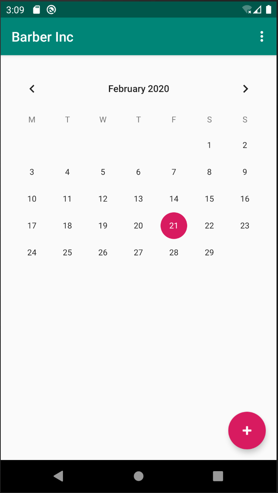
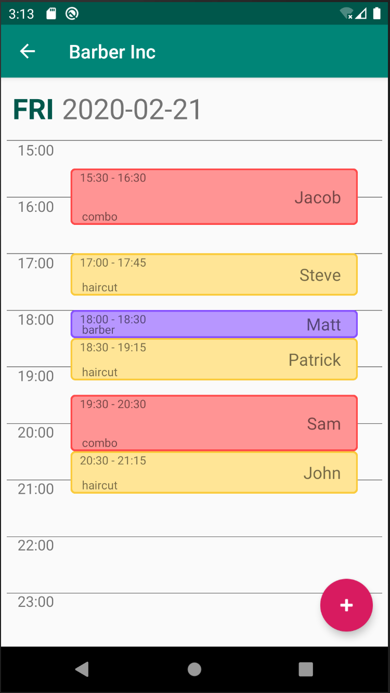
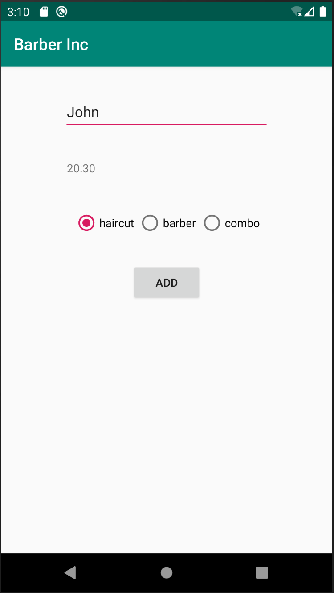

# BarberInc

## Overview 
Simple app that helps schedule visits in small one-man show barbershop. Main functionalities:
* Adding new visit - parameters that need to be provided:
    * date
    * time
    * name
    * visit type
* Adding new visit on certain date - parameters that need to be provided:
    * time
    * name
    * visit type
* Displaying visits on certain date

Functionalities that are going to be implemented in the future:
* Deleting visits
* Setting visit's types duration from an app
* Resolving time conflicts

## Screenshots

