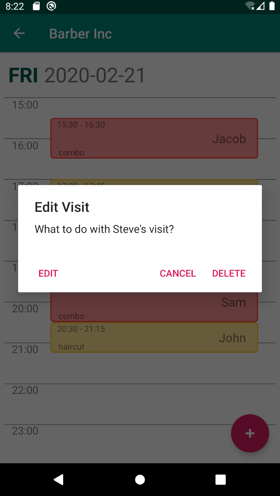
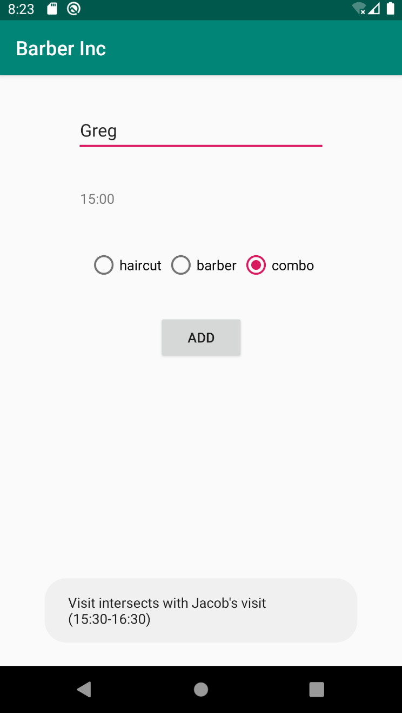

# BarberInc

## Overview 
Simple app that helps schedule visits in small one-man barbershop. Main functionalities:
* Adding new visit - parameters that need to be provided:
    * date
    * time
    * name
    * visit type
* Adding new visit on certain date - parameters that need to be provided:
    * time
    * name
    * visit type
* Displaying visits on certain date
* Editing visits on certain date
* Deleting visits on certain date

## Disclaimer
For now app is fully functional and it is being tested manually by my barber friend, also there is always something new to implement :)

## TODO
* Warning is displayed and user is not able to add (or edit) visit which starts before other ends etc. (visits intersection). In the future there shuould be possibility to add visits that slightly intersect
* Add settings menu

## Screenshots

